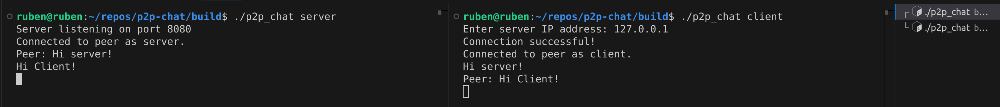

# Peer to peer chat
In this project I created a local peer to peer chat in C. The chat has a server and client component that can write messages to each other and receive each others messages.
## How to run
To build the project with CMake, run the following commands:
```
cd build
cmake ..
cmake --build .
```

The binary will then be build and placed in the build directory. To run and test the application, first start the server. From the project root, run:
```
cd build
./p2p_chat server
```

Then, in a separate terminal, start the client. From the project root, run:
```
cd build
./p2p_chat client
```

When the client is started you will be prompted to enter and IP-address. Since the server socket binds to all available interfaces, any interface address with an IPV4 address should work. In the example below, the loopback address is used (127.0.0.1).


## Discussion
This project was very interesting, I haven't written a lot of C up to this point. I have experience with C++ but C feels a lot more bare-bones. I enjoy the simplicity of C but I realize that since there isn't a lot of built in tools in the language, many things you have to write yourself or use from a library.

I am also new to both network programming and asynchronous programming. I have read networking code in the past but it was interesting to get a deeper understanding of what these networking functions in C actually do. The asynchronicity in this project is quite simple, each peer creates a thread to handle receiving messages before handling message sending, to be able to both receive and send messages.